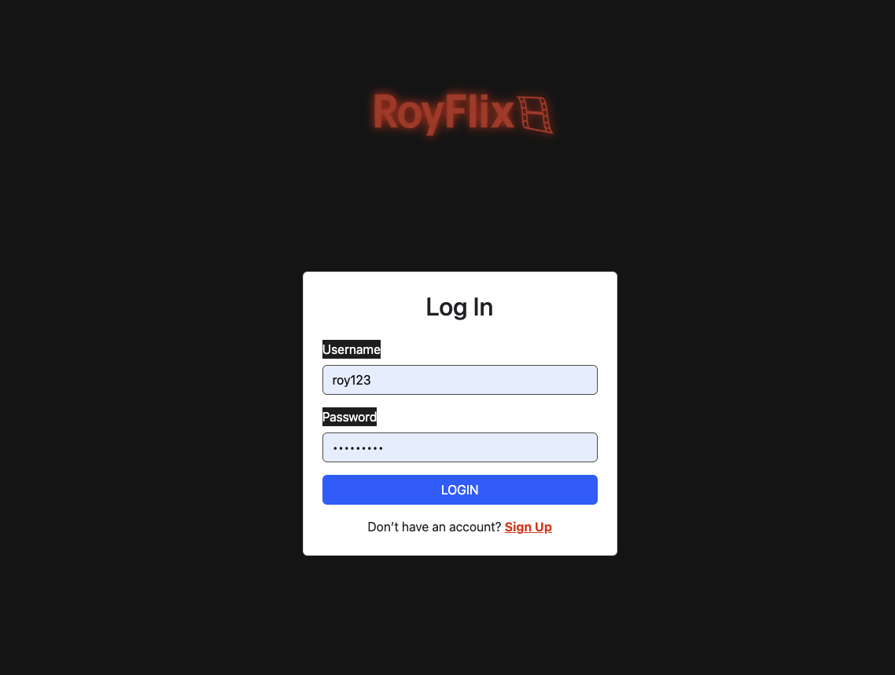
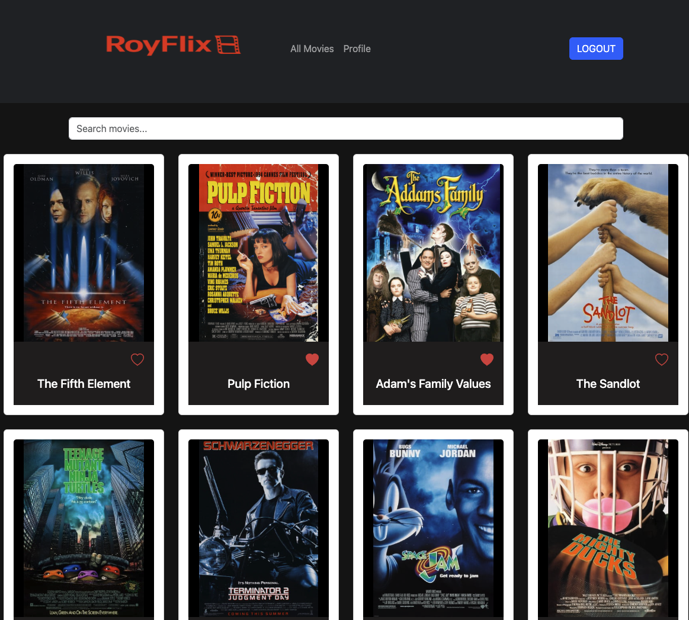
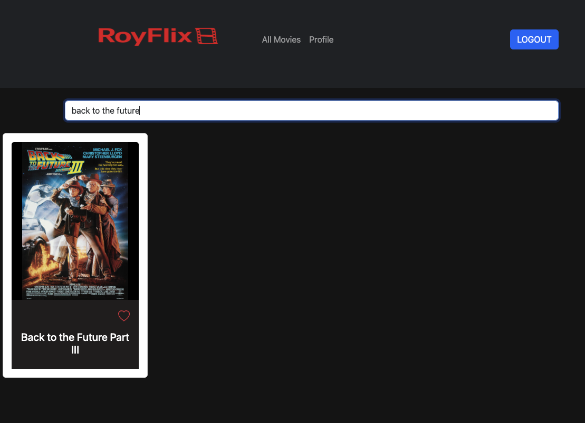
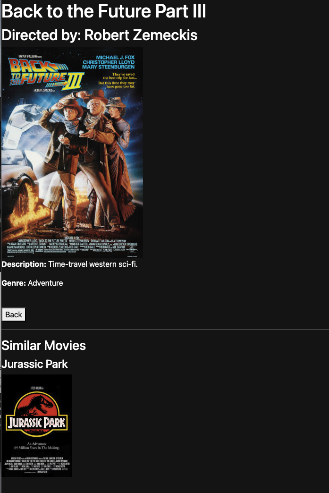
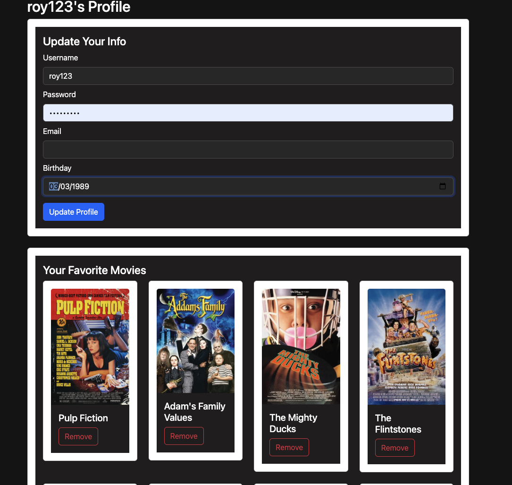

# 🎬 RoyFlix – A Movie Database App

RoyFlix is a full-stack 90's movie app that lets users browse movies, view detailed info, manage favorites, and update their profile. Built with React, it connects to a secure REST API and features responsive design and authentication.

## 🌐 Live Site

👉 [RoyFlix App on Netlify](https://royflixapp.netlify.app)

## 📁 GitHub Repo

🔗 [RoyFlix Frontend on GitHub](https://github.com/Royjysmael/myFlix-client)

## ✨ Features

- 🔐 User authentication with JWT
- 🎥 Browse a list of movies with cover images and details
- 🔍 Live movie search filter
- ❤️ Add/remove favorite movies
- 👤 Update user profile or deregister
- 📱 Fully responsive with React Bootstrap
- 🚀 Deployed to Netlify with Parcel

## 🛠️ Tech Stack

**Frontend**

- React
- React Router
- React Bootstrap
- Parcel

**Backend**

- Node.js + Express (separate API repo)
- MongoDB + Mongoose
- Passport (JWT authentication)

**Deployment**

- Frontend: [Netlify](https://www.netlify.com/)
- Backend: [Heroku](https://www.heroku.com/)

## 🖼️ Screenshot

### 👤 Login View

### 🎞️ Movie Grid

### 🔍 Search Filter in Action

### 🃏 Movie Card

### 👤 Profile View

